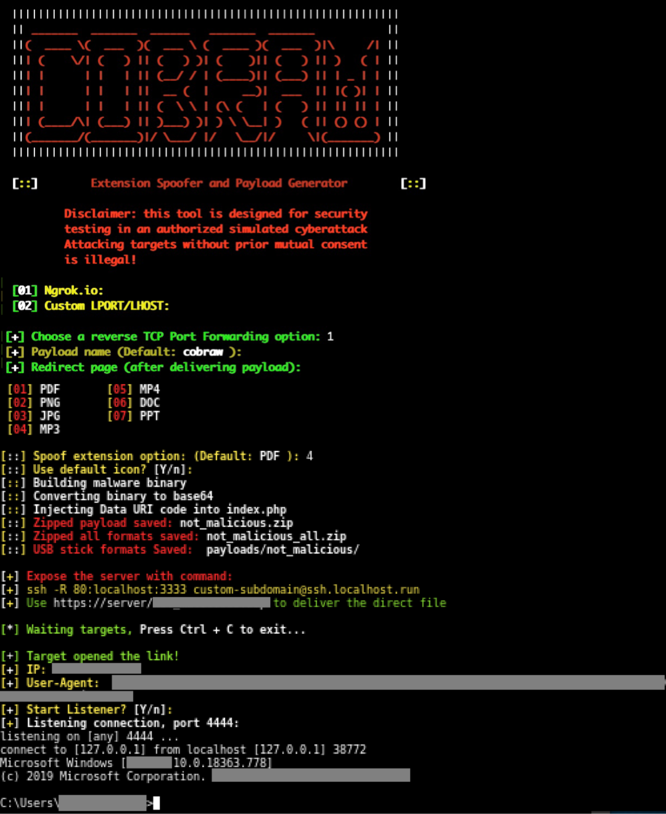

# COBRAW v1.1
## Instagram: instagram.com/programemers

Extension spoofer and reverse shell generator, get access to victim's shell.



### Features:
#### Reverse TCP Port Forwarding using Ngrok.io
#### Custom Port Forwarding option (LHOST,LPORT)

### Requirements:
#### Mingw-w64 compiler: apt-get install mingw-w64
#### Ngrok Authtoken (for TCP Tunneling): Sign up at: https://ngrok.com/signup
#### Your authtoken is available on your dashboard: https://dashboard.ngrok.com
#### Install your auhtoken: ./ngrok authtoken <YOUR_AUTHTOKEN>

## Legal disclaimer:

Usage of COBRAW for attacking targets without prior mutual consent is illegal. It's the end user's responsibility to obey all applicable local, state and federal laws. Developers assume no liability and are not responsible for any misuse or damage caused by this program 

### Usage:
```
git clone https://github.com/programemerz/cobraw
cd cobraw
bash cobraw.sh
```
